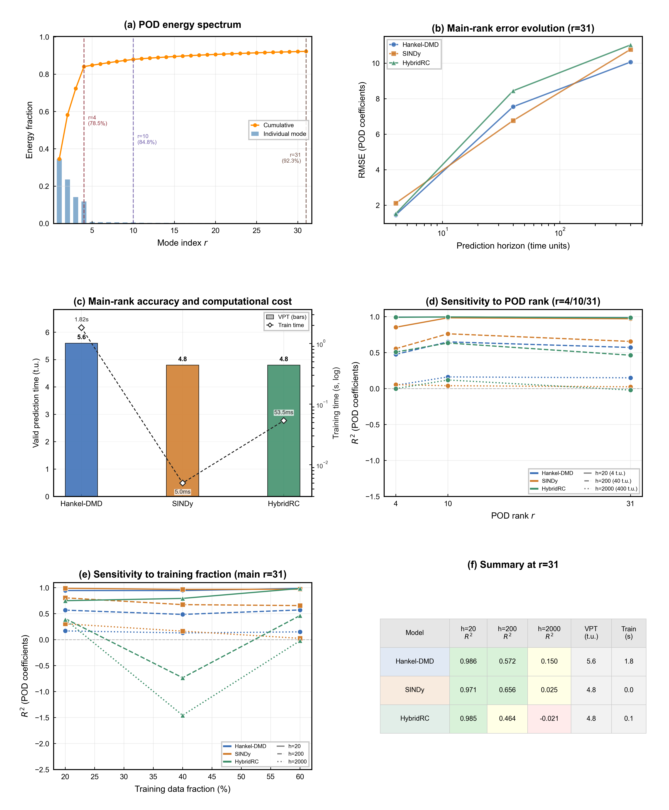

# ME5311 Project 2

This repository contains an end-to-end prediction pipeline in POD space:
load `data/vector_64.npy` -> train/val/test split -> POD/SVD reduction -> model training (Hankel-DMD, SINDy, HybridRC) -> metrics + figure + summary.

## Requirements

- Recommended: Python 3.9+
- Dependencies: see `requirements.txt`

## Quick Start on Windows (PowerShell)

Open PowerShell at the repository root (the folder containing `main.py`):

```powershell
python -m pip install --upgrade pip
pip install -r requirements.txt
python main.py
```

After running, outputs will be written to:

- `outputs/figure.png`
- `outputs/results.json`
- `outputs/summary.txt`

Example result figure:



## Common Arguments

```powershell
python main.py --data data/vector_64.npy --out outputs --r 31 --dt 0.2 --n-repeats 1
```

Run without embedded sensitivity collection (faster):

```powershell
python main.py --r 31 --no-collect-sensitivity
```

For all arguments:

```powershell
python main.py --help
```

## Models in Project 2

The final report compares exactly three model families:

1. **Hankel-DMD**: delay-embedded Koopman linear dynamics
2. **SINDy**: sparse symbolic dynamics with validation-based rank/threshold/mode selection
3. **HybridRC**: RC vs NVAR automatic backend selection on validation

## Output Policy (Strict)

After each top-level run, `outputs/` is forcibly cleaned to keep only:

- `outputs/figure.png`
- `outputs/results.json`
- `outputs/summary.txt`

No other files or folders are preserved in `outputs/`.

## Data

By default, the pipeline reads `data/vector_64.npy`.

- Expected shape: `(15000, 64, 64, 2)`
- Default time step: `dt=0.2`

## Repository Layout

- `main.py`: entry point and end-to-end pipeline
- `load_data.py`: data loading and root utilities
- `data_split.py`: temporal split and POD-space data preparation
- `pod_svd.py`: POD / SVD utilities
- `model_dmd.py`: Hankel-DMD training and rollout
- `model_sindy.py`: SINDy training/search/prediction
- `model_rc.py`: ESN/NVAR/HybridRC logic
- `metrics.py`: RMSE/NRMSE/R²/correlation/VPT and comparison
- `visualization.py`: report figure generation
- `data/`: input data
- `outputs/`: final outputs
